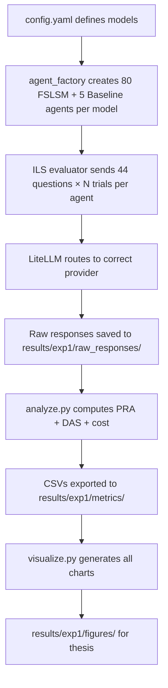

# Pre-Commit Review — Experiment 1 Full Pipeline

This walkthrough covers **all uncommitted changes** in the `mcp-rag` repository. The changes implement the complete **Experiment 1 (Virtual Student Agent Fidelity)** pipeline, including the LiteLLM migration, knowledge-level integration, non-personalized baseline, and all analysis/visualization tooling.

---

## Summary of Changes

| Category | Files | What Changed |
|----------|-------|-------------|
| **Modified** | 4 files | Constants, profiles, DB model, LLM client |
| **New** | ~14 source files + hundreds of result JSONs | Agents, evaluators, metrics, visualizer, migrations, runners, work-plans |
| **Untracked config** | [.claude/settings.json](file:///Users/nyeinchanaung/Documents/GitHub/mcp-rag/.claude/settings.json) | IDE settings (consider `.gitignore`) |

---

## 1. LLM Client → LiteLLM Refactor

#### [MODIFY] [llm_client.py](file:///Users/nyeinchanaung/Documents/GitHub/mcp-rag/src/utils/llm_client.py)

**Before:** Three separate provider methods (`_openai_chat`, `_anthropic_chat`, `_ollama_chat`) with manual prompt formatting and different token-counting fields per provider.

**After:** A single `litellm.completion()` call handles everything. Key improvements:

- **`MODEL_REGISTRY`** maps short config names (e.g., `gpt-4.1-mini`) → LiteLLM prefixed strings (`openai/gpt-4.1-mini`)
- **`LLMResponse`** dataclass now includes `total_tokens`, [cost](file:///Users/nyeinchanaung/Documents/GitHub/mcp-rag/src/evaluation/metrics.py#58-66) (USD per call), and `raw_response`
- **`LLMClient.chat()`** is ~15 lines instead of ~80, with `num_retries=3` built in
- Suppresses LiteLLM verbose logs via `litellm.suppress_debug_info = True`

> [!IMPORTANT]
> The `LLMProvider` enum is completely removed. Provider routing is fully delegated to LiteLLM. This eliminates the cross-model adapter confound for the thesis methodology.

---

## 2. Model Version Updates

#### [MODIFY] [constants.py](file:///Users/nyeinchanaung/Documents/GitHub/mcp-rag/config/constants.py)

The `MODELS` dict updates from older model names to current ones:

```diff
-    "gpt-4o-mini": "openai",
-    "claude-sonnet-4-5-20251001": "anthropic",
+    "gpt-4.1-mini": "openai",
+    "claude-sonnet-4-20250514": "anthropic",
```

Also adds:
- `KNOWLEDGE_LEVELS` list and `KNOWLEDGE_LEVEL_MAP` (instances 1–3 → beginner/intermediate/advanced, 4–5 → general)
- `NUM_LEVELED_AGENTS = 48`, `NUM_GENERAL_AGENTS = 32`
- `BASELINE_PROFILE_CODE = "P00_Baseline"`, `NUM_BASELINE_INSTANCES = 5`

---

## 3. Knowledge Level + Baseline in Database

#### [MODIFY] [models.py](file:///Users/nyeinchanaung/Documents/GitHub/mcp-rag/db/models.py)

Adds `knowledge_level: Mapped[Optional[str]]` column (String(20)) to the `Agent` model.

#### [NEW] [9dd44b55cb91_add_knowledge_level_to_agents.py](file:///Users/nyeinchanaung/Documents/GitHub/mcp-rag/db/migrations/versions/9dd44b55cb91_add_knowledge_level_to_agents.py)

Alembic migration adding [knowledge_level](file:///Users/nyeinchanaung/Documents/GitHub/mcp-rag/src/evaluation/metrics.py#46-56) column to [agents](file:///Users/nyeinchanaung/Documents/GitHub/mcp-rag/src/agents/agent_factory.py#27-98) table.

#### [NEW] [2a31f84c6cdc_allow_zero_in_fslsm_dimension_checks_.py](file:///Users/nyeinchanaung/Documents/GitHub/mcp-rag/db/migrations/versions/2a31f84c6cdc_allow_zero_in_fslsm_dimension_checks_.py)

Relaxes CHECK constraints on `fslsm_profiles` dimensions from `IN (-1, 1)` → `IN (-1, 0, 1)` to allow the baseline profile's zero values.

#### [MODIFY] [profiles.json](file:///Users/nyeinchanaung/Documents/GitHub/mcp-rag/data/fslsm/profiles.json)

Adds the `P00_Baseline` profile with all dimensions = 0, empty behavioral instructions, and descriptor "No learning style preference assigned."

---

## 4. Agent Factory

#### [NEW] [agent_factory.py](file:///Users/nyeinchanaung/Documents/GitHub/mcp-rag/src/agents/agent_factory.py)

Two factory functions:

| Function | Creates | Notes |
|----------|---------|-------|
| [create_agents(llm_model)](file:///Users/nyeinchanaung/Documents/GitHub/mcp-rag/src/agents/agent_factory.py#27-98) | 80 FSLSM agents (16 profiles × 5 instances) | Skips `P00_Baseline`; assigns knowledge levels per `KNOWLEDGE_LEVEL_MAP`; idempotent (skips existing `agent_uid`s) |
| [create_baseline_agents(llm_model)](file:///Users/nyeinchanaung/Documents/GitHub/mcp-rag/src/agents/agent_factory.py#100-156) | 5 baseline agents | All linked to `P00_Baseline` profile; same knowledge-level mapping |

Both use [_model_tag()](file:///Users/nyeinchanaung/Documents/GitHub/mcp-rag/src/agents/agent_factory.py#18-25) to create filesystem-safe UIDs like `gpt41mini_P01_ActSenVisSeq_I01_beg`.

---

## 5. System Prompt Builders

#### [NEW] [student_system.py](file:///Users/nyeinchanaung/Documents/GitHub/mcp-rag/src/agents/prompts/student_system.py)

- **[build_student_system_prompt(profile, knowledge_level)](file:///Users/nyeinchanaung/Documents/GitHub/mcp-rag/src/agents/prompts/student_system.py#28-80)** — Constructs a detailed persona prompt with FSLSM dimension instructions and optional knowledge-level instructions (beginner/intermediate/advanced paragraphs).
- **[build_baseline_system_prompt(knowledge_level)](file:///Users/nyeinchanaung/Documents/GitHub/mcp-rag/src/agents/prompts/student_system.py#82-109)** — Deliberately neutral: says "respond naturally based on your own preferences — you have no specific learning style assignment." No FSLSM leakage.

#### [NEW] [ils_answering.py](file:///Users/nyeinchanaung/Documents/GitHub/mcp-rag/src/agents/prompts/ils_answering.py)

Single function [build_ils_question_prompt(question)](file:///Users/nyeinchanaung/Documents/GitHub/mcp-rag/src/agents/prompts/ils_answering.py#5-22) — formats one ILS question as a user prompt, instructing the agent to respond with only "a" or "b".

---

## 6. ILS Evaluator

#### [NEW] [ils_evaluator.py](file:///Users/nyeinchanaung/Documents/GitHub/mcp-rag/src/agents/ils_evaluator.py)

Three key functions:

- **[run_ils_for_agent(agent_info, questions, client, trial)](file:///Users/nyeinchanaung/Documents/GitHub/mcp-rag/src/agents/ils_evaluator.py#18-86)** — Runs 44 ILS questions for one agent, extracts a/b choices, accumulates dimension scores ([-11, +11]), saves raw response JSON, returns [(dim_scores, total_cost)](file:///Users/nyeinchanaung/Documents/GitHub/mcp-rag/experiments/exp1_agent_fidelity/visualize.py#29-92).
- **[run_experiment1(llm_model, num_trials, temperature)](file:///Users/nyeinchanaung/Documents/GitHub/mcp-rag/src/agents/ils_evaluator.py#88-174)** — Orchestrates all 80 FSLSM agents across N trials. Includes **resume support**: skips agent-trials whose raw response file already exists.
- **[run_baseline_experiment(...)](file:///Users/nyeinchanaung/Documents/GitHub/mcp-rag/src/agents/ils_evaluator.py#176-253)** — Same flow for 5 baseline agents. Results include `detected` poles but no `assigned` (since baseline has no target profile).

> [!NOTE]
> All agent data is eagerly extracted from the ORM before the session closes to avoid detached-instance issues during long-running API calls.

---

## 7. Metrics & Evaluation

#### [NEW] [metrics.py](file:///Users/nyeinchanaung/Documents/GitHub/mcp-rag/src/evaluation/metrics.py) (227 lines)

| Function | Purpose |
|----------|---------|
| [profile_recovery_accuracy(results)](file:///Users/nyeinchanaung/Documents/GitHub/mcp-rag/src/evaluation/metrics.py#9-44) | PRA per dimension + overall 4D; ties count as mismatches |
| [pra_by_knowledge_level(results)](file:///Users/nyeinchanaung/Documents/GitHub/mcp-rag/src/evaluation/metrics.py#46-56) | Slices PRA by beginner/intermediate/advanced/general |
| [cost_summary(results)](file:///Users/nyeinchanaung/Documents/GitHub/mcp-rag/src/evaluation/metrics.py#58-66) | Aggregates LiteLLM per-call costs |
| [baseline_pra_vs_all_profiles(baseline, profiles)](file:///Users/nyeinchanaung/Documents/GitHub/mcp-rag/src/evaluation/metrics.py#68-130) | Computes baseline PRA against all 16 profiles; reports best-match profile and dimension bias |
| [compute_das_for_results(results)](file:///Users/nyeinchanaung/Documents/GitHub/mcp-rag/src/evaluation/metrics.py#143-186) | Formula-based DAS: [(raw_score × assigned + 11) / 22](file:///Users/nyeinchanaung/Documents/GitHub/mcp-rag/experiments/exp1_agent_fidelity/visualize.py#29-92) per dimension |
| [compute_baseline_das(baseline, profiles)](file:///Users/nyeinchanaung/Documents/GitHub/mcp-rag/src/evaluation/metrics.py#188-227) | DAS for baseline agents averaged across all 16 profiles (expected ~0.5) |

---

## 8. Visualization

#### [NEW] [visualizer.py](file:///Users/nyeinchanaung/Documents/GitHub/mcp-rag/src/evaluation/visualizer.py) (525 lines)

10 visualization functions producing matplotlib charts saved to `results/exp1/figures/`:

1. `radar_chart` — Per-agent assigned vs detected polar plot
2. `heatmap_profiles` — 16 profiles × 4 dimensions alignment rate
3. `model_comparison_bar` — 3 models × 4 dimensions PRA bars
4. `knowledge_level_comparison` — PRA by knowledge level per model
5. `cost_per_model_bar` — Total USD cost per model
6. `fslsm_vs_baseline_bar` — Side-by-side FSLSM vs Baseline PRA
7. `baseline_bias_radar` — Natural dimension bias radar overlay
8. `heatmap_baseline_bias` — Raw ILS scores per baseline agent
9. `das_fslsm_vs_baseline_bar` — DAS comparison
10. `das_comparison_bar` — DAS by model and dimension

---

## 9. Experiment Runners

#### [NEW] [run.py](file:///Users/nyeinchanaung/Documents/GitHub/mcp-rag/experiments/exp1_agent_fidelity/run.py)

Main FSLSM experiment runner: creates 80 agents → runs ILS → saves results → prints PRA + cost summary.

#### [NEW] [run_baseline.py](file:///Users/nyeinchanaung/Documents/GitHub/mcp-rag/experiments/exp1_agent_fidelity/run_baseline.py)

Baseline experiment runner: creates 5 baseline agents → runs ILS → saves results → computes baseline PRA vs all 16 profiles → prints cost.

#### [NEW] [analyze.py](file:///Users/nyeinchanaung/Documents/GitHub/mcp-rag/experiments/exp1_agent_fidelity/analyze.py)

Post-experiment analysis: loads all per-model results, computes PRA + DAS + cost for both FSLSM and Baseline conditions, exports CSVs:
- `pra_das_summary.csv` (with `condition` column: FSLSM/Baseline)
- `baseline_analysis.csv`
- `cost_summary.csv`
- `das_summary.csv`

#### [NEW] [visualize.py](file:///Users/nyeinchanaung/Documents/GitHub/mcp-rag/experiments/exp1_agent_fidelity/visualize.py)

Runs all 10 visualization functions from CSVs and result JSONs.

---

## 10. Experiment Results (Data)

The `results/exp1/` directory contains:
- **`raw_responses/`** — Hundreds of JSON files (one per agent-trial, e.g., `gpt41mini_P06_ActIntVisGlo_I02_int_trial2.json`)
- **`metrics/`** — Per-model result JSONs and baseline result JSONs

> [!WARNING]
> The `results/` directory contains many large data files. Consider whether all raw response JSONs should be committed or if only the aggregated metrics are needed in the repo.

---

## 11. Work Plan Documents

#### [NEW] [1_1_exp1_phase2_v2_litellm.md](file:///Users/nyeinchanaung/Documents/GitHub/mcp-rag/work-plan/1_1_exp1_phase2_v2_litellm.md)

Detailed planning document for Phase 2 v2 with LiteLLM migration rationale, step-by-step implementation guide, and thesis methodology integration.

#### [NEW] [1_1_exp1_task2.8_baseline.md](file:///Users/nyeinchanaung/Documents/GitHub/mcp-rag/work-plan/1_1_exp1_task2.8_baseline.md)

Addendum documenting the non-personalized baseline design: rationale, DB setup, prompt design, PRA computation method, and expected thesis outputs (Table 3.2).

---

## 12. Other Files

| File | Notes |
|------|-------|
| `.claude/settings.json` | IDE settings — consider adding to `.gitignore` |

---

## Process Flow

The overall process these changes enable:


